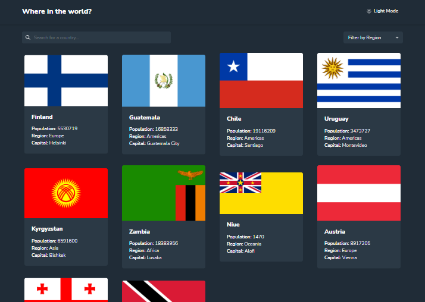
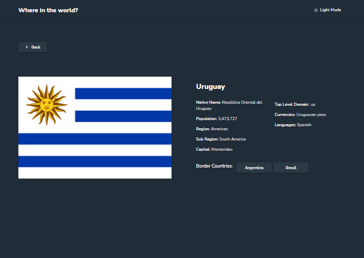

# Frontend Mentor - REST Countries API with color theme switcher solution

This is a solution to the [REST Countries API with color theme switcher challenge on Frontend Mentor](https://www.frontendmentor.io/challenges/rest-countries-api-with-color-theme-switcher-5cacc469fec04111f7b848ca). Frontend Mentor challenges help you improve your coding skills by building realistic projects. 

## Table of contents

- [Frontend Mentor - REST Countries API with color theme switcher solution](#frontend-mentor---rest-countries-api-with-color-theme-switcher-solution)
  - [Table of contents](#table-of-contents)
  - [Overview](#overview)
    - [The challenge](#the-challenge)
    - [Screenshot](#screenshot)
    - [Links](#links)
  - [My process](#my-process)
    - [Built with](#built-with)
    - [Continued development](#continued-development)
    - [Useful resources](#useful-resources)
  - [Author](#author)

## Overview

### The challenge

Users should be able to:

- See all countries from the API on the homepage
- Search for a country using an `input` field
- Filter countries by region
- Click on a country to see more detailed information on a separate page
- Click through to the border countries on the detail page
- Toggle the color scheme between light and dark mode *(optional)*

### Screenshot

### Links

- Solution URL: [GitHub](https://github.com/lemartinezm/rest-countries-api)
- Live Site URL: [Vercel](https://rest-countries-api-omega-orpin.vercel.app/)

## My process

### Built with

- Semantic HTML5 markup
- CSS custom properties
- Flexbox
- Grid
- Mobile-first workflow
- [React](https://reactjs.org/) - JS library
- [Chakra UI](https://chakra-ui.com/docs/components) - Components for React

### Continued development

- React
- Chakra UI

### Useful resources

- [Chakra UI](https://chakra-ui.com/docs/components) - This helped me for props documentation.

## Author

- Frontend Mentor - [@lemartinezm](https://www.frontendmentor.io/profile/lemartinezm)
- LinkedIn - [lemartinezm](https://www.linkedin.com/in/lemartinezm)
- Twitter - [@Luis14151617](https://twitter.com/Luis14151617)